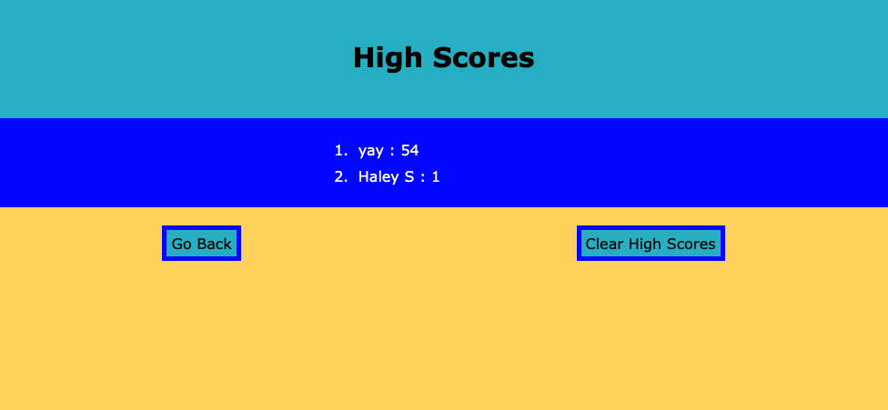

# AthleticTrainingQuiz
LICENSE : [GNU Public License](./LICENSE)

INSTALLATION: Fork this repository and clone it to your local source using git clone commands.

PACKAGES: None.

DESCRIPTION: This project is a trivia game made with HTML, CSS and Javascript. The goal was to use the DOM to build an interactive game that incorporates concepts we've recently learned about including timers, event listeners, form submissions, local storage, etc. The HTML for this game is therefore minimal as most of the content is build in the javascript file. 

When the game is started by clicking the "start quiz" button, a multiple choice question is displayed and a 1 minute timer begins. When an answer is selected, the screen will display for 2 seconds if it was correct or incorrect, as well as move on to the next question. If the answer was incorrrect, 10 seconds are subtracted from the timer. The timer turns in to the score at the end of the game. The game is ended once the player completed all the questions (6 in total) or the timer runs out.

After the game ends, the player is taken to a screen that shows their score and contains an input field to enter their initials. Their score and initials are sent to local storage, where there is a building list of player scores. The list of player scores is sorted to have the best score on top, and is displayed on the 'high scores' page when the player submits their initials. On the high score page, there is an option to clear the list of scores (resetting local storage). From the homepage and question pages, there is always an option to open the high scores page (if selected during game play, the game will end) which will pull form local storage the list of scores. 

Please check out this project by clicking [here](https://hseymo.github.io/AthleticTrainingQuiz/).

APPLICATION SCREENSHOTS:  
Homepage:  

Example Question Page:  

Form to Input Initials:  

Highscores Page:  

Acknowledgments: Thank you to the University of Washington Web Development Bootcamp for teaching me the skills to create this trivia game.

QUESTIONS: If you have questions, please contact me on Github at [hseymo](https://githup.com/hseymo) or by [email](mailto:fake@gmail.com).